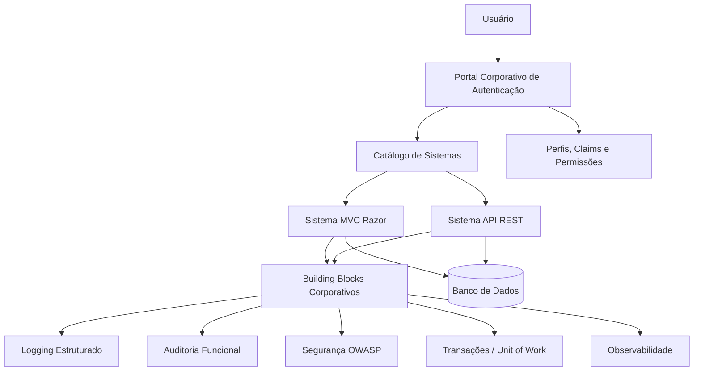

# Proposta Técnica — Plataforma Corporativa de Arquitetura, Segurança, UI/UX e Componentização

**Versão:** 1.0  
**Stack principal:** .NET 8+, ASP.NET Core MVC Razor, APIs REST  
**Objetivo:** Criar um padrão corporativo para desenvolvimento de sistemas internos, com autenticação centralizada, autorização por perfis/permissões, componentes reutilizáveis de front-end e back-end, segurança baseada em OWASP, logging, auditoria, transações, observabilidade e governança técnica.  
**Documento preparado para:** apresentação técnica, alinhamento com gestão e uso como prompt/base de trabalho para IA/Codex/agentes de desenvolvimento.

---

## 1. Resumo Executivo

A empresa precisa evoluir de um modelo onde cada sistema nasce de forma isolada para um modelo de **plataforma corporativa padronizada**.

A proposta é criar uma base comum para todos os sistemas desenvolvidos pelo departamento de TI, garantindo que cada novo projeto já nasça com:

- autenticação centralizada;
- autorização por perfil, claims, policies e permissões granulares;
- portal único de acesso aos sistemas;
- identidade visual padronizada;
- componentes Razor reutilizáveis;
- componentes backend reutilizáveis;
- middlewares corporativos;
- logging estruturado;
- auditoria funcional;
- controle transacional;
- APIs REST padronizadas;
- documentação mínima obrigatória;
- checklist de segurança baseado em OWASP;
- governança de arquitetura;
- pipeline de build, teste e deploy;
- redução de retrabalho entre sistemas.

A iniciativa deve ser tratada como uma **plataforma interna de engenharia de software**, e não apenas como um layout padrão ou um conjunto de bibliotecas.

---

## 2. Nome Sugerido para a Iniciativa

Sugestões de nome para o projeto:

1. **CoreTI Platform**
2. **Arquitetura Corporativa Digital**
3. **Enterprise Foundation Kit**
4. **TI Standard Platform**
5. **Company Digital Core**
6. **Framework Corporativo de Sistemas**
7. **Base Única de Desenvolvimento Corporativo**

Nome recomendado para apresentação interna:

> **CoreTI Platform — Plataforma Corporativa de Arquitetura, Segurança e Experiência Digital**

---

## 3. Problema Atual

Sem um padrão corporativo, cada sistema tende a resolver os mesmos problemas de formas diferentes:

- cada sistema possui seu próprio login;
- cada sistema implementa autorização de forma distinta;
- telas e fluxos visuais não seguem identidade única;
- componentes de front-end são recriados várias vezes;
- logs são inconsistentes;
- exceções são tratadas de forma diferente;
- auditoria é ausente ou incompleta;
- APIs seguem padrões diferentes;
- integrações não possuem contrato único;
- segurança é tratada de forma reativa;
- manutenção depende muito do desenvolvedor que criou o sistema;
- novos projetos demoram mais para começar;
- há dificuldade em escalar boas práticas para todo o time.

---

## 4. Objetivo Geral

Criar uma arquitetura corporativa padrão para sistemas internos baseada em .NET 8+, ASP.NET Core MVC Razor e APIs REST, com componentes reutilizáveis de front-end e back-end, autenticação centralizada, autorização por perfis e permissões, segurança baseada em OWASP, logging, auditoria, transações e governança técnica.

---

## 5. Objetivos Específicos

- Criar um **portal central de autenticação**.
- Criar um **catálogo de sistemas corporativos**.
- Criar um modelo de **usuários, perfis, grupos, permissões e policies**.
- Padronizar a estrutura de soluções .NET.
- Criar pacotes reutilizáveis internos.
- Criar um design system para MVC Razor.
- Criar componentes Razor reutilizáveis.
- Criar middlewares corporativos.
- Padronizar logging técnico.
- Padronizar auditoria funcional.
- Padronizar APIs REST.
- Aplicar práticas OWASP Top 10 e OWASP ASVS.
- Criar templates de projeto.
- Criar documentação mínima obrigatória.
- Criar checklist de arquitetura, segurança e qualidade.
- Criar pipeline inicial de CI/CD.
- Criar um sistema piloto para validar a arquitetura.

---

## 6. Escopo

### 6.1 Dentro do Escopo

- Portal de autenticação e autorização.
- Cadastro de usuários.
- Cadastro de sistemas.
- Cadastro de perfis.
- Cadastro de permissões.
- Controle de acesso por claims/policies.
- Integração com MVC Razor.
- Integração com APIs REST.
- Layout corporativo padrão.
- Biblioteca de componentes Razor.
- Middlewares corporativos.
- Logging e auditoria.
- Padrão de resposta de API.
- Padrão de tratamento de erro.
- Segurança OWASP.
- Documentação técnica.
- Template de solução .NET.
- Backlog inicial de implementação.

### 6.2 Fora do Escopo Inicial

- Substituir todos os sistemas legados imediatamente.
- Criar uma plataforma low-code completa.
- Criar microserviços obrigatórios para todos os domínios.
- Migrar bancos existentes na primeira fase.
- Implantar SSO com todos os fornecedores externos na primeira versão.
- Criar mobile app nativo.

---

## 7. Princípios Arquiteturais

1. **Segurança por padrão**  
   Todo sistema deve nascer protegido, autenticado, autorizado e auditável.

2. **Reutilização antes de recriação**  
   Componentes comuns devem virar pacotes, templates ou componentes Razor.

3. **Separação de responsabilidades**  
   Camadas de Web, API, Application, Domain e Infrastructure devem ter responsabilidades claras.

4. **Autenticação centralizada**  
   Usuários não devem ter um login diferente por sistema.

5. **Autorização granular**  
   O controle de acesso deve funcionar por sistema, perfil, permissão e policy.

6. **Observabilidade desde o início**  
   Logs, métricas, tracing e auditoria devem fazer parte do template base.

7. **Padrão visual único**  
   Sistemas internos devem parecer parte de uma mesma plataforma.

8. **APIs previsíveis**  
   APIs devem seguir convenções claras de rota, payload, erro, paginação e versionamento.

9. **Documentação obrigatória**  
   Todo sistema deve possuir documentação mínima de arquitetura, segurança, banco, APIs, deploy e testes.

10. **Evolução incremental**  
   A plataforma deve começar como MVP e evoluir por fases.

---

## 8. Arquitetura-Alvo



---

## 9. Visão Macro da Plataforma

```text
Usuário
  ↓
Portal.Auth
  ↓
Login / MFA / Sessão / Token
  ↓
Catálogo de Sistemas
  ↓
Sistema MVC Razor ou API REST
  ↓
Building Blocks Corporativos
  ↓
Logs / Auditoria / Segurança / Banco / Observabilidade
```

---

## 10. Stack Tecnológica Recomendada

### 10.1 Backend

- .NET 8 ou superior.
- ASP.NET Core MVC.
- ASP.NET Core Web API.
- Razor Views.
- Razor Class Library para componentes UI.
- Entity Framework Core.
- ASP.NET Core Identity.
- OpenID Connect.
- JWT Bearer para APIs.
- Cookie Authentication para aplicações MVC.
- FluentValidation.
- Serilog ou logging estruturado via `ILogger`.
- OpenTelemetry.
- Swagger/OpenAPI.
- Health Checks.
- Rate Limiting.
- ProblemDetails.

### 10.2 Front-end

- MVC Razor.
- Razor Views.
- ViewComponents.
- TagHelpers.
- CSS corporativo com tokens.
- JavaScript modular.
- Biblioteca visual interna.
- Bootstrap pode ser usado como base, se for decisão da empresa.
- Acessibilidade baseada em WCAG.

### 10.3 Banco de Dados

A arquitetura deve ser compatível com:

- SQL Server;
- PostgreSQL;
- Oracle, se necessário;
- SQLite apenas para testes locais ou prototipação.

O provedor de banco deve ser configurável por ambiente.

---

## 11. Portal Corporativo de Autenticação

### 11.1 Objetivo

Criar um portal único onde o usuário realiza login e acessa os sistemas autorizados.

Esse portal também será responsável por administrar:

- usuários;
- sistemas;
- perfis;
- permissões;
- grupos;
- claims;
- políticas de acesso;
- auditoria de login/logout;
- sessões ativas;
- permissões por sistema.

---

### 11.2 Modelo Conceitual

```text
User
  ├── UserProfile
  ├── UserGroup
  ├── UserClaim
  └── UserSystemAccess

System
  ├── SystemModule
  ├── SystemPermission
  └── SystemRole

Role/Profile
  ├── RolePermission
  └── RoleClaim

Permission
  ├── Code
  ├── Description
  ├── SystemId
  └── ModuleId
```

---

### 11.3 Entidades Principais

#### User

Representa o usuário corporativo.

Campos sugeridos:

- Id;
- UserName;
- Email;
- DisplayName;
- EmployeeCode;
- Department;
- IsActive;
- LastLoginAt;
- CreatedAt;
- UpdatedAt.

#### CorporateSystem

Representa um sistema disponível no portal.

Campos sugeridos:

- Id;
- Name;
- Code;
- Description;
- BaseUrl;
- Icon;
- IsActive;
- RequiresMfa;
- CreatedAt;
- UpdatedAt.

#### Permission

Representa uma permissão granular.

Exemplos:

```text
Usuario.Visualizar
Usuario.Criar
Usuario.Editar
Usuario.Excluir
Pedido.Aprovar
Relatorio.Exportar
Configuracao.Acessar
```

Campos sugeridos:

- Id;
- SystemId;
- Module;
- Code;
- Description;
- IsCritical;
- CreatedAt.

#### Profile / Role

Representa um papel de acesso.

Exemplos:

```text
Administrador
Gestor
Operador
Consulta
Auditor
Aprovador
```

---

### 11.4 Modelo de Autenticação

Aplicações MVC Razor devem utilizar:

- OpenID Connect para autenticação;
- Cookie Authentication para sessão web;
- Claims para informações do usuário;
- Policies para autorização;
- logout centralizado.

APIs REST devem utilizar:

- JWT Bearer;
- validação de issuer;
- validação de audience;
- validação de assinatura;
- validação de expiração;
- policies por permissão.

---

### 11.5 Exemplo de Claims

```json
{
  "sub": "12345",
  "name": "Leonardo Mendes",
  "email": "leonardo@empresa.com.br",
  "department": "TI",
  "systems": ["PortalRH", "Financeiro"],
  "permissions": [
    "Usuario.Visualizar",
    "Usuario.Criar",
    "Pedido.Aprovar"
  ]
}
```

---

### 11.6 Autorização por Policy

Exemplo conceitual:

```csharp
[Authorize(Policy = "Usuario.Criar")]
public IActionResult Criar()
{
    return View();
}
```

No front-end:

```html
<app-permission permission="Usuario.Criar">
    <a class="btn btn-primary" href="/Usuarios/Criar">Novo Usuário</a>
</app-permission>
```

Regra importante:

> O front-end pode esconder botões e menus, mas a proteção real sempre deve acontecer no back-end.

---

## 12. Estrutura Padrão de Solução .NET

Todo sistema novo deve seguir uma estrutura mínima:

```text
Company.Product.sln

/src
  /Company.Product.Web
    Controllers
    Views
    ViewComponents
    TagHelpers
    wwwroot

  /Company.Product.Api
    Controllers
    Endpoints
    Swagger

  /Company.Product.Application
    UseCases
    Services
    DTOs
    Validators
    Interfaces
    Behaviors

  /Company.Product.Domain
    Entities
    Enums
    ValueObjects
    DomainEvents
    Specifications

  /Company.Product.Infrastructure
    Persistence
    Repositories
    Integrations
    Messaging
    Storage
    Cache

  /Company.Product.SharedKernel
    Abstractions
    Results
    Notifications
    Pagination
    Exceptions

/tests
  /Company.Product.UnitTests
  /Company.Product.IntegrationTests
  /Company.Product.ArchitectureTests
```

---

## 13. Projetos Recomendados para a Plataforma

```text
Company.CoreTI.Platform.sln

/src
  /Company.CoreTI.Auth.Web
  /Company.CoreTI.Auth.Api
  /Company.CoreTI.Auth.Application
  /Company.CoreTI.Auth.Domain
  /Company.CoreTI.Auth.Infrastructure

  /Company.BuildingBlocks.Web
  /Company.BuildingBlocks.Api
  /Company.BuildingBlocks.Security
  /Company.BuildingBlocks.Logging
  /Company.BuildingBlocks.Auditing
  /Company.BuildingBlocks.Data
  /Company.BuildingBlocks.Observability
  /Company.BuildingBlocks.Validation
  /Company.BuildingBlocks.UI

  /Company.Template.Mvc
  /Company.Template.Api

/tests
  /Company.CoreTI.UnitTests
  /Company.CoreTI.IntegrationTests
  /Company.CoreTI.ArchitectureTests
```

---

## 14. Building Blocks Corporativos

A empresa deve criar pacotes internos reutilizáveis, preferencialmente publicados em um feed NuGet privado.

### 14.1 Pacotes Sugeridos

| Pacote | Responsabilidade |
|---|---|
| `Company.BuildingBlocks.Web` | Middlewares, filtros MVC, controllers base, extensões web |
| `Company.BuildingBlocks.Api` | Response padrão, ProblemDetails, paginação, versionamento, Swagger |
| `Company.BuildingBlocks.Security` | CurrentUser, claims, permission handler, policies |
| `Company.BuildingBlocks.Logging` | Correlation ID, enrichers, request logging, Serilog config |
| `Company.BuildingBlocks.Auditing` | Auditoria funcional, trilha de alterações, before/after |
| `Company.BuildingBlocks.Data` | Unit of Work, transações, repositórios base, migrations |
| `Company.BuildingBlocks.Observability` | OpenTelemetry, tracing, métricas, health checks |
| `Company.BuildingBlocks.Validation` | FluentValidation, mensagens padrão, validações comuns |
| `Company.BuildingBlocks.UI` | Razor Class Library, ViewComponents, TagHelpers, CSS/JS corporativo |

---

## 15. Middlewares Corporativos

### 15.1 Pipeline Padrão

```csharp
var builder = WebApplication.CreateBuilder(args);

builder.Services.AddControllersWithViews();
builder.Services.AddAuthentication();
builder.Services.AddAuthorization();
builder.Services.AddRateLimiter(options =>
{
    // Políticas corporativas de rate limit
});

var app = builder.Build();

if (!app.Environment.IsDevelopment())
{
    app.UseExceptionHandler("/Error");
    app.UseHsts();
}

app.UseHttpsRedirection();
app.UseStaticFiles();

app.UseMiddleware<CorrelationIdMiddleware>();
app.UseMiddleware<SecurityHeadersMiddleware>();
app.UseMiddleware<RequestLoggingMiddleware>();

app.UseRouting();

app.UseAuthentication();
app.UseRateLimiter();
app.UseAuthorization();

app.UseMiddleware<RequestAuditMiddleware>();

app.MapControllerRoute(
    name: "default",
    pattern: "{controller=Home}/{action=Index}/{id?}");

app.MapControllers();

app.Run();
```

---

### 15.2 Lista de Middlewares

| Middleware | Objetivo |
|---|---|
| `CorrelationIdMiddleware` | Criar ou propagar ID único da requisição |
| `ExceptionHandlingMiddleware` | Tratar exceções e padronizar erros |
| `SecurityHeadersMiddleware` | Adicionar headers de segurança |
| `RequestLoggingMiddleware` | Registrar método, rota, status, tempo e usuário |
| `RequestAuditMiddleware` | Auditar ações críticas |
| `TransactionMiddleware` | Controlar transação em operações configuradas |
| `CurrentUserMiddleware` | Disponibilizar usuário logado para as camadas internas |
| `TenantMiddleware` | Resolver tenant, empresa, filial ou unidade, se aplicável |
| `RateLimitMiddleware` | Controlar volume de requisições |
| `LocalizationMiddleware` | Definir cultura, idioma e timezone |

---

### 15.3 Correlation ID

Todo request deve possuir um identificador único.

Cabeçalhos sugeridos:

```text
X-Correlation-Id
X-Request-Id
traceparent
```

Exemplo de log:

```json
{
  "correlationId": "b8c4e782f4e84a45a0b6bafcb97ef1c3",
  "method": "POST",
  "path": "/api/v1/usuarios",
  "statusCode": 201,
  "elapsedMs": 184
}
```

---

### 15.4 Security Headers

Headers mínimos recomendados:

```text
Strict-Transport-Security
X-Content-Type-Options: nosniff
X-Frame-Options: DENY
Referrer-Policy: no-referrer
Permissions-Policy
Content-Security-Policy
```

Observação:

> Content Security Policy deve ser aplicada gradualmente, pois pode quebrar scripts e estilos existentes se for ativada de forma agressiva.

---

### 15.5 Tratamento Global de Exceções

O padrão deve impedir que stack traces sejam exibidos ao usuário em produção.

Para APIs, retornar ProblemDetails ou envelope de erro padronizado.

Exemplo:

```json
{
  "success": false,
  "error": {
    "code": "UNEXPECTED_ERROR",
    "message": "Ocorreu um erro inesperado. Informe o código de rastreio ao suporte.",
    "details": []
  },
  "correlationId": "b8c4e782f4e84a45a0b6bafcb97ef1c3"
}
```

---

## 16. Logging Técnico

### 16.1 Objetivo

Permitir rastreabilidade técnica, suporte, diagnóstico de falhas e análise de performance.

### 16.2 Campos Mínimos

```json
{
  "timestamp": "2026-05-30T10:15:00-03:00",
  "level": "Information",
  "application": "PortalRH",
  "environment": "Production",
  "correlationId": "abc-123",
  "traceId": "00-...",
  "userId": "42",
  "userName": "usuario.empresa",
  "ip": "10.0.0.15",
  "method": "POST",
  "path": "/api/v1/requisicoes",
  "statusCode": 201,
  "elapsedMs": 184,
  "message": "Requisição criada com sucesso"
}
```

---

### 16.3 O que Não Logar

Nunca registrar em log:

- senha;
- token completo;
- refresh token;
- cookie de sessão;
- número completo de documento;
- dados bancários;
- dados pessoais sensíveis;
- corpo de requisição sem mascaramento;
- headers sensíveis;
- segredo de integração;
- connection string.

---

## 17. Auditoria Funcional

### 17.1 Diferença entre Log e Auditoria

```text
Log técnico
  → Erros, exceções, performance, requisições, diagnóstico.

Auditoria funcional
  → Quem fez, o que fez, quando fez, onde fez, antes/depois.
```

---

### 17.2 Ações que Devem Ser Auditadas

- login;
- logout;
- falha de login;
- criação de usuário;
- alteração de perfil;
- concessão de permissão;
- remoção de permissão;
- criação de registros críticos;
- edição de registros críticos;
- exclusão lógica;
- aprovação;
- reprovação;
- exportação de relatório;
- alteração de configuração;
- troca de senha;
- desbloqueio de conta.

---

### 17.3 Schema de Auditoria

```json
{
  "auditId": "uuid",
  "application": "PortalRH",
  "entity": "RequisicaoAumentoQuadro",
  "entityId": "123",
  "action": "Create",
  "userId": "42",
  "userName": "usuario.empresa",
  "date": "2026-05-30T10:15:00-03:00",
  "ip": "10.0.0.15",
  "correlationId": "abc-123",
  "before": null,
  "after": {
    "cargo": "Desenvolvedor .NET",
    "status": "PendenteAprovacao"
  },
  "reason": "Criação de requisição pelo gestor"
}
```

---

## 18. Controle Transacional

### 18.1 Princípio

Nem toda requisição deve abrir transação automaticamente.

Regra sugerida:

| Método | Transação |
|---|---|
| GET | Não |
| POST | Sim, quando alterar estado |
| PUT | Sim |
| PATCH | Sim |
| DELETE | Sim |

---

### 18.2 Padrão Recomendado

```text
Controller
  ↓
Application Service / Use Case
  ↓
UnitOfWork.BeginTransaction()
  ↓
Repositories / EF Core
  ↓
SaveChanges()
  ↓
Commit()
```

---

### 18.3 Interface Base

```csharp
public interface IUnitOfWork
{
    Task BeginTransactionAsync(CancellationToken cancellationToken = default);
    Task CommitAsync(CancellationToken cancellationToken = default);
    Task RollbackAsync(CancellationToken cancellationToken = default);
    Task<int> SaveChangesAsync(CancellationToken cancellationToken = default);
}
```

---

### 18.4 Cuidados

- Não manter transação aberta durante chamadas HTTP externas.
- Não usar transação longa para processos demorados.
- Usar Outbox Pattern quando houver persistência + evento/mensagem.
- Garantir rollback em exceções.
- Registrar correlationId na transação/auditoria.
- Preferir transação explícita em casos críticos.

---

## 19. Padrão de APIs REST

### 19.1 Convenção de Rotas

```text
GET    /api/v1/produtos
GET    /api/v1/produtos/{id}
POST   /api/v1/produtos
PUT    /api/v1/produtos/{id}
PATCH  /api/v1/produtos/{id}/status
DELETE /api/v1/produtos/{id}
```

---

### 19.2 Envelope de Sucesso

```json
{
  "success": true,
  "data": {},
  "message": "Operação realizada com sucesso.",
  "correlationId": "abc-123"
}
```

---

### 19.3 Envelope de Erro

```json
{
  "success": false,
  "error": {
    "code": "VALIDATION_ERROR",
    "message": "Existem campos inválidos.",
    "details": [
      {
        "field": "email",
        "message": "E-mail inválido."
      }
    ]
  },
  "correlationId": "abc-123"
}
```

---

### 19.4 Paginação Padrão

Request:

```text
GET /api/v1/produtos?page=1&pageSize=20&sort=name&direction=asc
```

Response:

```json
{
  "success": true,
  "data": {
    "items": [],
    "page": 1,
    "pageSize": 20,
    "totalItems": 120,
    "totalPages": 6
  },
  "correlationId": "abc-123"
}
```

---

### 19.5 Status Codes

| Código | Uso |
|---|---|
| 200 | Consulta ou atualização com retorno |
| 201 | Criação |
| 204 | Operação sem conteúdo |
| 400 | Erro de validação |
| 401 | Não autenticado |
| 403 | Sem permissão |
| 404 | Recurso não encontrado |
| 409 | Conflito de regra ou concorrência |
| 422 | Entidade inválida semanticamente |
| 500 | Erro inesperado |

---

## 20. Segurança OWASP

### 20.1 Referência Base

A plataforma deve usar:

- **OWASP Top 10** como referência de conscientização dos principais riscos.
- **OWASP ASVS** como checklist técnico verificável.
- **OWASP API Security** para APIs REST.
- **OWASP Cheat Sheet Series** para temas específicos.

---

### 20.2 OWASP Top 10 2025 — Aplicação no Projeto

| Categoria OWASP | Aplicação na Plataforma |
|---|---|
| A01 Broken Access Control | Policies, claims, permissões granulares, validação server-side |
| A02 Security Misconfiguration | templates seguros, headers, ambientes separados, defaults seguros |
| A03 Software Supply Chain Failures | controle de pacotes, lock file, scan de dependências |
| A04 Cryptographic Failures | HTTPS, proteção de secrets, criptografia adequada |
| A05 Injection | queries parametrizadas, EF Core, validação de entrada |
| A06 Insecure Design | threat modeling, revisão de arquitetura, DoR com segurança |
| A07 Authentication Failures | OIDC, MFA, bloqueio de conta, política de senha |
| A08 Software/Data Integrity Failures | CI/CD seguro, assinatura, controle de deploy |
| A09 Security Logging and Alerting Failures | logs, auditoria, alertas e correlação |
| A10 Mishandling of Exceptional Conditions | tratamento global de exceções, erro seguro, ProblemDetails |

---

### 20.3 Checklist Mínimo de Segurança

#### Autenticação

- Login centralizado.
- MFA opcional ou obrigatório para perfis críticos.
- Política de senha.
- Bloqueio por tentativas inválidas.
- Expiração de sessão.
- Logout centralizado.

#### Autorização

- Permissão por sistema.
- Permissão por módulo.
- Permissão por ação.
- Policy-based authorization.
- Bloqueio server-side obrigatório.
- Menus e botões baseados em permissão.

#### APIs

- JWT Bearer.
- Validação de issuer.
- Validação de audience.
- Validação de expiração.
- Rate limiting.
- Swagger protegido em produção.
- Versionamento.

#### MVC Razor

- Anti-forgery tokens.
- Cookies seguros.
- HttpOnly.
- Secure.
- SameSite.
- Validação server-side.
- Encoding de saída.
- CSP gradual.

#### Banco de Dados

- Usuário de banco com menor privilégio possível.
- Migrations controladas.
- Sem senha hardcoded.
- Queries parametrizadas.
- Soft delete quando necessário.
- Auditoria para dados críticos.

#### Logs

- Não logar dados sensíveis.
- Mascarar PII.
- Usar correlationId.
- Centralizar logs.
- Alertar erros críticos.

#### Secrets

- Não versionar secrets.
- Usar User Secrets em desenvolvimento.
- Usar cofre de segredos em produção.
- Rotacionar secrets críticos.

---

## 21. Design System Corporativo

### 21.1 Objetivo

Criar uma identidade visual única para os sistemas internos, garantindo consistência, produtividade e melhor experiência para o usuário.

---

### 21.2 Estrutura Recomendada

```text
Company.BuildingBlocks.UI

/wwwroot
  /company-ui
    /css
      tokens.css
      layout.css
      components.css
      forms.css
      tables.css
      utilities.css
    /js
      app.js
      components.js
      forms.js
      tables.js
      masks.js

/Views
  /Shared
    _Layout.cshtml
    _Sidebar.cshtml
    _Topbar.cshtml
    _Breadcrumb.cshtml
    _Footer.cshtml

/ViewComponents
  AppCard
  AppKpiCard
  AppDataTable
  AppModal
  AppToast
  AppBreadcrumb
  AppStatusBadge
  AppPermission
  AppFormField

/TagHelpers
  AppInputTagHelper
  AppSelectTagHelper
  AppButtonTagHelper
  AppAlertTagHelper
  AppPermissionTagHelper
```

---

### 21.3 Tokens de Design

```css
:root {
  --color-primary: #1F4E79;
  --color-primary-dark: #153955;
  --color-secondary: #64748B;
  --color-success: #16A34A;
  --color-warning: #F59E0B;
  --color-danger: #DC2626;
  --color-info: #0284C7;

  --color-background: #F8FAFC;
  --color-surface: #FFFFFF;
  --color-border: #E2E8F0;
  --color-text: #0F172A;
  --color-muted: #64748B;

  --font-family-base: "Inter", "Segoe UI", Arial, sans-serif;

  --spacing-xs: 4px;
  --spacing-sm: 8px;
  --spacing-md: 16px;
  --spacing-lg: 24px;
  --spacing-xl: 32px;

  --radius-sm: 4px;
  --radius-md: 8px;
  --radius-lg: 12px;

  --shadow-sm: 0 1px 2px rgba(15, 23, 42, 0.08);
  --shadow-md: 0 8px 24px rgba(15, 23, 42, 0.12);
}
```

---

### 21.4 Componentes Obrigatórios

| Componente | Finalidade |
|---|---|
| Layout padrão | Sidebar, header, conteúdo, footer |
| Botões | Ações primárias, secundárias, destrutivas |
| Inputs | Formulários padronizados |
| Selects | Seleções simples e múltiplas |
| Tabelas | Listagem, paginação, filtro e ações |
| Cards | Conteúdo, KPIs e atalhos |
| Modais | Confirmação e edição rápida |
| Toasts | Feedback de sucesso, erro, alerta e informação |
| Badges | Status, tipo, prioridade e categoria |
| Breadcrumb | Navegação contextual |
| Empty State | Tela sem dados |
| Loading State | Carregamento e skeleton |
| Error State | Erros de tela com orientação ao usuário |
| Permission Wrapper | Renderização condicional por permissão |

---

### 21.5 Padrões de UX

- Mensagens claras e humanas.
- Evitar termos técnicos para usuário final.
- Confirmar ações destrutivas.
- Manter botão principal sempre evidente.
- Informar sucesso após salvar.
- Exibir loading em operações demoradas.
- Preservar dados digitados em caso de erro.
- Sinalizar campos obrigatórios.
- Usar validação inline.
- Usar máscara quando fizer sentido.
- Usar estados vazios úteis.
- Usar breadcrumbs em telas profundas.
- Usar responsividade mínima.
- Garantir contraste adequado.
- Suportar navegação por teclado nos principais fluxos.

---

## 22. Padrão Visual das Aplicações

### 22.1 Layout Base

```text
+----------------------------------------------------+
| Topbar: nome do sistema, busca, usuário            |
+----------------------+-----------------------------+
| Sidebar              | Conteúdo principal           |
| - Dashboard          | Breadcrumb                   |
| - Cadastros          | Título da página             |
| - Operações          | Filtros / Ações              |
| - Relatórios         | Tabela / Cards / Formulário  |
| - Configurações      |                             |
+----------------------+-----------------------------+
```

---

### 22.2 Estrutura de Tela Padrão

Toda tela deve conter:

- breadcrumb;
- título claro;
- descrição curta, quando necessário;
- área de ações principais;
- filtros;
- conteúdo;
- paginação, quando aplicável;
- mensagens de feedback;
- tratamento de erro.

---

## 23. Padrões de Dados

### 23.1 Entidade Base

```csharp
public abstract class BaseEntity
{
    public Guid Id { get; protected set; }
    public DateTime CreatedAt { get; protected set; }
    public string? CreatedBy { get; protected set; }
    public DateTime? UpdatedAt { get; protected set; }
    public string? UpdatedBy { get; protected set; }
    public bool IsDeleted { get; protected set; }
}
```

---

### 23.2 Convenções

- Tabelas no singular ou plural, conforme padrão definido pela empresa.
- Colunas auditáveis em entidades críticas.
- Chave primária preferencialmente `Guid`, salvo decisão contrária por domínio.
- Soft delete para cadastros sensíveis.
- Migrations versionadas.
- Índices para campos de busca.
- Constraints de unicidade para códigos corporativos.

---

## 24. Observabilidade

### 24.1 Pilares

```text
Logs
  → O que aconteceu.

Métricas
  → Quanto, com que frequência, com qual desempenho.

Tracing
  → Por onde a requisição passou.
```

---

### 24.2 Métricas Recomendadas

- Total de requisições.
- Tempo médio de resposta.
- Percentil P95/P99.
- Taxa de erro 4xx.
- Taxa de erro 5xx.
- Logins com sucesso.
- Falhas de login.
- Acessos negados.
- Operações críticas por sistema.
- Uso por usuário/perfil.

---

### 24.3 Health Checks

Todo sistema deve expor health checks.

Rotas sugeridas:

```text
/health
/health/live
/health/ready
```

Validações:

- aplicação online;
- banco de dados;
- serviços externos críticos;
- filas, se houver;
- storage, se houver.

---

## 25. Documentação Obrigatória por Sistema

Cada sistema deve possuir:

```text
README.md
ARCHITECTURE.md
SECURITY.md
API_CONTRACT.md
DATABASE.md
DEPLOYMENT.md
TEST_PLAN.md
CHANGELOG.md
ADR/
```

---

### 25.1 README.md

Deve conter:

- objetivo do sistema;
- stack utilizada;
- como executar localmente;
- variáveis de ambiente;
- dependências;
- comandos úteis;
- responsáveis.

### 25.2 ARCHITECTURE.md

Deve conter:

- visão geral;
- diagrama de arquitetura;
- camadas;
- integrações;
- decisões técnicas;
- riscos.

### 25.3 SECURITY.md

Deve conter:

- autenticação;
- autorização;
- permissões;
- dados sensíveis;
- checklist OWASP;
- riscos conhecidos.

### 25.4 API_CONTRACT.md

Deve conter:

- endpoints;
- payloads;
- status codes;
- exemplos;
- autenticação;
- erros.

### 25.5 DATABASE.md

Deve conter:

- entidades;
- tabelas;
- migrations;
- relacionamentos;
- índices;
- política de auditoria.

### 25.6 DEPLOYMENT.md

Deve conter:

- ambientes;
- variáveis;
- pipeline;
- rollback;
- comandos de deploy.

### 25.7 TEST_PLAN.md

Deve conter:

- cenários de teste;
- testes unitários;
- testes de integração;
- testes de segurança;
- evidências esperadas.

---

## 26. Definition of Ready

Uma demanda só deve entrar em desenvolvimento quando possuir:

- objetivo claro;
- regra de negócio descrita;
- critério de aceite;
- impacto em permissões;
- impacto em auditoria;
- impacto em banco de dados;
- impacto em APIs;
- impacto visual, quando houver tela;
- validações necessárias;
- mensagens de erro esperadas;
- dependências externas mapeadas.

---

## 27. Definition of Done

Uma entrega só deve ser considerada concluída quando possuir:

- código implementado no padrão;
- testes mínimos criados;
- validações implementadas;
- logs implementados;
- auditoria implementada, se aplicável;
- permissões aplicadas;
- tratamento de erro;
- Swagger atualizado;
- documentação atualizada;
- changelog atualizado;
- revisão de segurança;
- evidência funcional.

---

## 28. Checklist de Code Review

- A estrutura de camadas foi respeitada?
- Controller está fino?
- Regra de negócio está fora da View/Controller?
- Há validação de entrada?
- Há autorização no endpoint/action?
- Há auditoria em ação crítica?
- Há log suficiente para suporte?
- Há vazamento de dados sensíveis em log?
- Exceções são tratadas?
- APIs seguem padrão de response?
- Código possui nomes claros?
- Há duplicação que deveria virar componente?
- Há teste mínimo?
- Há impacto em segurança?
- Há impacto em performance?

---

## 29. Testes

### 29.1 Tipos de Teste

| Tipo | Objetivo |
|---|---|
| Unitário | Testar regras isoladas |
| Integração | Testar banco, API e infraestrutura |
| Arquitetura | Garantir dependência correta entre camadas |
| Segurança | Validar acesso, permissões e entradas inválidas |
| UI | Validar fluxos principais |
| Regressão | Evitar quebra de funcionalidades existentes |

---

### 29.2 Testes Mínimos para o Portal.Auth

- Login com sucesso.
- Login inválido.
- Bloqueio por tentativas.
- Logout.
- Usuário sem permissão não acessa sistema.
- Usuário sem permissão não visualiza menu.
- Usuário com permissão acessa tela.
- API rejeita JWT inválido.
- API rejeita token expirado.
- API retorna 403 para permissão insuficiente.
- Auditoria registra login.
- Auditoria registra alteração de perfil.

---

## 30. DevOps e CI/CD

### 30.1 Pipeline Mínimo

Etapas:

```text
Restore
Build
Test
Security Scan
Publish
Package
Deploy Dev
Deploy HML
Deploy PRD
```

---

### 30.2 Qualidade no Pipeline

O pipeline deve falhar quando:

- build quebrar;
- testes obrigatórios falharem;
- vulnerabilidade crítica for encontrada;
- projeto não compilar em Release;
- migration inválida for detectada;
- package version estiver inválida.

---

## 31. Roadmap de Implantação

### Fase 1 — Fundação Técnica

Objetivo: criar a base arquitetural.

Entregáveis:

- documento de arquitetura;
- template .NET 8 MVC/API;
- estrutura de camadas;
- logging básico;
- tratamento de erro;
- response padrão;
- health check;
- Swagger;
- pacote inicial `BuildingBlocks`.

---

### Fase 2 — Portal.Auth MVP

Objetivo: criar o primeiro portal funcional.

Entregáveis:

- login;
- logout;
- usuários;
- sistemas;
- perfis;
- permissões;
- claims;
- policies;
- tela “Meus Sistemas”;
- auditoria de login;
- auditoria de alteração de perfil.

---

### Fase 3 — Design System Razor

Objetivo: padronizar UI/UX.

Entregáveis:

- layout padrão;
- sidebar;
- topbar;
- breadcrumb;
- botões;
- cards;
- tabelas;
- formulários;
- modais;
- toasts;
- badges;
- tokens CSS;
- documentação visual.

---

### Fase 4 — Segurança e Observabilidade

Objetivo: elevar maturidade técnica.

Entregáveis:

- checklist OWASP;
- security headers;
- rate limiting;
- OpenTelemetry;
- dashboard de logs;
- dashboard de métricas;
- alertas críticos;
- health checks completos.

---

### Fase 5 — Sistema Piloto

Objetivo: validar a plataforma em um caso real.

Entregáveis:

- um sistema real usando Portal.Auth;
- menus por permissão;
- UI corporativa;
- APIs padronizadas;
- logs;
- auditoria;
- documentação;
- lições aprendidas.

---

## 32. Backlog Inicial

### Epic 1 — Arquitetura Corporativa

Objetivo: documentar e formalizar o padrão.

PBIs:

1. Criar documento `ARCHITECTURE.md` da plataforma.
2. Definir estrutura padrão de solução.
3. Definir padrão de nomenclatura.
4. Definir padrão de APIs REST.
5. Definir padrão de logging.
6. Definir padrão de auditoria.
7. Definir checklist de segurança.
8. Definir Definition of Ready e Definition of Done.

---

### Epic 2 — Building Blocks Backend

Objetivo: criar bibliotecas reutilizáveis.

PBIs:

1. Criar `Company.BuildingBlocks.Web`.
2. Criar `Company.BuildingBlocks.Api`.
3. Criar `Company.BuildingBlocks.Security`.
4. Criar `Company.BuildingBlocks.Logging`.
5. Criar `Company.BuildingBlocks.Auditing`.
6. Criar `Company.BuildingBlocks.Data`.
7. Criar `Company.BuildingBlocks.Observability`.
8. Criar pacote NuGet interno.

---

### Epic 3 — Portal.Auth

Objetivo: criar portal central de autenticação e autorização.

PBIs:

1. Criar solução base do Portal.Auth.
2. Configurar ASP.NET Core Identity.
3. Criar cadastro de usuários.
4. Criar cadastro de sistemas.
5. Criar cadastro de perfis.
6. Criar cadastro de permissões.
7. Criar vínculo usuário x sistema.
8. Criar vínculo perfil x permissão.
9. Criar tela de login.
10. Criar tela “Meus Sistemas”.
11. Criar emissão de claims.
12. Criar autorização por policy.
13. Criar auditoria de login/logout.

---

### Epic 4 — UI Kit Corporativo

Objetivo: criar biblioteca visual reutilizável.

PBIs:

1. Criar Razor Class Library.
2. Criar layout padrão.
3. Criar sidebar.
4. Criar topbar.
5. Criar breadcrumb.
6. Criar botões.
7. Criar cards.
8. Criar tabelas.
9. Criar formulários.
10. Criar modais.
11. Criar toasts.
12. Criar badges.
13. Criar tokens CSS.
14. Criar documentação de uso.

---

### Epic 5 — Segurança

Objetivo: aplicar baseline OWASP.

PBIs:

1. Criar security headers middleware.
2. Configurar HTTPS/HSTS.
3. Configurar anti-forgery para MVC.
4. Configurar rate limiting.
5. Criar checklist OWASP Top 10.
6. Criar checklist ASVS nível inicial.
7. Configurar proteção de secrets.
8. Configurar política de logs sem PII.
9. Configurar Swagger protegido em produção.
10. Criar testes de autorização.

---

### Epic 6 — Observabilidade

Objetivo: garantir rastreabilidade.

PBIs:

1. Criar correlation ID.
2. Criar request logging.
3. Criar audit logging.
4. Criar health checks.
5. Configurar OpenTelemetry.
6. Configurar métricas básicas.
7. Criar dashboard inicial.
8. Criar alertas para erro 5xx.

---

### Epic 7 — Sistema Piloto

Objetivo: validar a plataforma em uma aplicação real.

PBIs:

1. Criar sistema piloto baseado no template.
2. Integrar com Portal.Auth.
3. Aplicar UI Kit.
4. Criar permissões do sistema piloto.
5. Criar menus baseados em permissão.
6. Criar APIs padronizadas.
7. Criar logs e auditoria.
8. Criar documentação completa.
9. Fazer revisão técnica.
10. Registrar lições aprendidas.

---

## 33. MVP Recomendado

O primeiro MVP deve conter apenas o necessário para provar valor:

### MVP 1 — Fundação

- Solução .NET 8.
- Estrutura em camadas.
- MVC Razor.
- API REST.
- Swagger.
- Health check.
- Logging.
- Correlation ID.
- Tratamento global de erros.
- Response padrão.

### MVP 2 — Auth

- Login.
- Usuário.
- Perfil.
- Sistema.
- Permissão.
- Meus Sistemas.
- Controle de acesso por policy.

### MVP 3 — UI

- Layout padrão.
- Sidebar.
- Topbar.
- Botões.
- Cards.
- Formulários.
- Tabelas.
- Badges.

### MVP 4 — Segurança

- HTTPS.
- Security headers.
- Anti-forgery.
- Rate limit.
- Auditoria de login.
- Auditoria de alteração de perfil.

---

## 34. Entregáveis Esperados

Ao final da primeira implantação, a empresa deve possuir:

```text
1. Plataforma de autenticação centralizada.
2. Template oficial de sistema MVC/API.
3. Pacotes BuildingBlocks.
4. UI Kit Razor corporativo.
5. Padrão de APIs REST.
6. Padrão de logs e auditoria.
7. Checklist OWASP.
8. Documentação técnica.
9. Sistema piloto.
10. Guia de adoção para novos sistemas.
```

---

## 35. Prompt Mestre para IA/Codex Criar a Base

Use o prompt abaixo em uma IA de desenvolvimento para iniciar a geração do projeto.

```text
Você é um arquiteto de software sênior e engenheiro .NET especialista em ASP.NET Core 8+, MVC Razor, APIs REST, segurança OWASP, autenticação/autorização, logging estruturado, auditoria, transações e componentização corporativa.

Sua tarefa é criar a base inicial de uma plataforma chamada CoreTI Platform.

Objetivo:
Criar uma solução .NET 8+ para padronizar sistemas corporativos, contendo um Portal de Autenticação, Building Blocks reutilizáveis, UI Kit Razor e template de sistemas MVC/API.

Stack obrigatória:
- .NET 8 ou superior
- ASP.NET Core MVC Razor
- ASP.NET Core Web API
- Entity Framework Core
- ASP.NET Core Identity
- OpenID Connect preparado conceitualmente
- JWT Bearer preparado para APIs
- Cookie Authentication para MVC
- FluentValidation
- Swagger/OpenAPI
- Health Checks
- Logging estruturado via ILogger/Serilog
- Correlation ID
- Auditoria funcional
- Middlewares corporativos
- Razor Class Library para UI Kit

Crie a seguinte estrutura:

/src
  /Company.CoreTI.Auth.Web
  /Company.CoreTI.Auth.Api
  /Company.CoreTI.Auth.Application
  /Company.CoreTI.Auth.Domain
  /Company.CoreTI.Auth.Infrastructure

  /Company.BuildingBlocks.Web
  /Company.BuildingBlocks.Api
  /Company.BuildingBlocks.Security
  /Company.BuildingBlocks.Logging
  /Company.BuildingBlocks.Auditing
  /Company.BuildingBlocks.Data
  /Company.BuildingBlocks.Observability
  /Company.BuildingBlocks.Validation
  /Company.BuildingBlocks.UI

/tests
  /Company.CoreTI.UnitTests
  /Company.CoreTI.IntegrationTests
  /Company.CoreTI.ArchitectureTests

Requisitos funcionais iniciais:
1. Criar cadastro de usuários.
2. Criar cadastro de sistemas corporativos.
3. Criar cadastro de perfis.
4. Criar cadastro de permissões.
5. Criar vínculo perfil x permissão.
6. Criar vínculo usuário x perfil.
7. Criar tela de login.
8. Criar tela “Meus Sistemas”.
9. Criar controle de menus por permissão.
10. Criar auditoria de login, logout e alteração de permissão.

Requisitos técnicos:
1. Implementar CorrelationIdMiddleware.
2. Implementar RequestLoggingMiddleware.
3. Implementar SecurityHeadersMiddleware.
4. Implementar RequestAuditMiddleware.
5. Implementar tratamento global de exceções.
6. Implementar response padrão para APIs.
7. Implementar paginação padrão.
8. Implementar UnitOfWork.
9. Implementar entidades base com CreatedAt, CreatedBy, UpdatedAt, UpdatedBy e IsDeleted.
10. Implementar policies de autorização baseadas em permissões.
11. Implementar TagHelper ou ViewComponent para renderizar conteúdo por permissão.
12. Implementar layout corporativo padrão em Razor.
13. Implementar componentes de UI: botão, card, tabela, badge, modal, toast, breadcrumb e formulário.
14. Criar Swagger para APIs.
15. Criar Health Checks.
16. Criar documentação README.md, ARCHITECTURE.md, SECURITY.md, API_CONTRACT.md, DATABASE.md e DEPLOYMENT.md.

Requisitos de segurança:
1. Não logar senha, token, cookie, documento completo ou dados sensíveis.
2. Aplicar HTTPS/HSTS.
3. Aplicar Security Headers.
4. Aplicar anti-forgery em formulários MVC.
5. Aplicar validação server-side.
6. Aplicar rate limiting básico.
7. Proteger endpoints com Authorize.
8. Usar policy-based authorization.
9. Preparar checklist OWASP Top 10 e ASVS.

Requisitos de qualidade:
1. Código limpo e organizado.
2. Controllers finos.
3. Regras de negócio fora dos controllers.
4. Interfaces bem definidas.
5. Separação clara entre Domain, Application e Infrastructure.
6. Testes unitários básicos.
7. Testes de integração básicos.
8. Testes de arquitetura para impedir dependências indevidas.
9. Documentação clara.

Saída esperada:
1. Criar todos os projetos.
2. Criar estrutura de pastas.
3. Criar entidades principais.
4. Criar DbContext.
5. Criar migrations iniciais, se possível.
6. Criar middlewares.
7. Criar componentes Razor.
8. Criar layout padrão.
9. Criar controllers e views iniciais.
10. Criar APIs iniciais.
11. Criar documentação markdown.
12. Explicar como executar localmente.
13. Explicar próximos passos.

Importante:
- Não criar código fake sem conexão com a arquitetura.
- Não colocar regra de negócio em View.
- Não colocar regra de negócio em Controller.
- Não deixar endpoints sem autorização, exceto login, health público e assets estáticos.
- Não versionar secrets.
- Não registrar dados sensíveis em log.
- Manter o projeto preparado para evolução corporativa.
```

---

## 36. Prompt para Gerar Apenas o UI Kit Razor

```text
Crie uma Razor Class Library chamada Company.BuildingBlocks.UI para ser usada como design system corporativo em aplicações ASP.NET Core MVC Razor.

A biblioteca deve conter:
- layout padrão;
- sidebar;
- topbar;
- breadcrumb;
- botões;
- cards;
- KPI cards;
- tabelas;
- formulários;
- inputs;
- selects;
- modais;
- toasts;
- badges de status;
- empty states;
- loading states;
- TagHelper para permissão;
- tokens CSS;
- JS modular para comportamentos básicos.

O design deve ser corporativo, moderno, limpo, responsivo e acessível.

Crie exemplos de uso em uma aplicação MVC Razor demonstrando:
- dashboard;
- listagem;
- cadastro;
- edição;
- detalhes;
- tela sem dados;
- erro tratado.
```

---

## 37. Prompt para Gerar Apenas os Building Blocks Backend

```text
Crie pacotes .NET 8 reutilizáveis para uma arquitetura corporativa.

Pacotes:
- Company.BuildingBlocks.Web
- Company.BuildingBlocks.Api
- Company.BuildingBlocks.Security
- Company.BuildingBlocks.Logging
- Company.BuildingBlocks.Auditing
- Company.BuildingBlocks.Data
- Company.BuildingBlocks.Observability
- Company.BuildingBlocks.Validation

Cada pacote deve conter abstrações, extensões de IServiceCollection, extensões de IApplicationBuilder, middlewares e modelos comuns.

Implemente:
- CorrelationIdMiddleware
- RequestLoggingMiddleware
- SecurityHeadersMiddleware
- RequestAuditMiddleware
- ExceptionHandlingMiddleware
- ICurrentUser
- IPermissionService
- PermissionRequirement
- PermissionAuthorizationHandler
- ApiResponse<T>
- ApiError
- PagedResult<T>
- BaseEntity
- IUnitOfWork
- AuditLog
- HealthCheckExtensions
- OpenTelemetryExtensions

Crie documentação de uso e exemplos de configuração no Program.cs.
```

---

## 38. Prompt para Gerar o Portal.Auth MVP

```text
Crie um portal de autenticação corporativo em ASP.NET Core 8 MVC Razor chamado Company.CoreTI.Auth.Web.

Requisitos:
- ASP.NET Core Identity
- Usuários
- Perfis/Roles
- Sistemas corporativos
- Permissões
- Vínculo usuário x perfil
- Vínculo perfil x permissão
- Tela de login
- Tela de logout
- Tela Meus Sistemas
- Menu dinâmico por permissão
- Auditoria de login/logout
- Auditoria de alteração de perfil/permissão
- Layout corporativo usando Company.BuildingBlocks.UI
- Controllers finos
- Application Services
- EF Core
- DbContext
- Migrations
- Validações
- Logs
- Correlation ID
- Tratamento global de erros
- Documentação README.md

Implemente também uma API chamada Company.CoreTI.Auth.Api para consulta de permissões e informações do usuário autenticado.
```

---

## 39. Riscos e Mitigações

| Risco | Mitigação |
|---|---|
| Plataforma ficar grande demais no início | Começar com MVP pequeno e evoluir por fases |
| Time não adotar o padrão | Criar template fácil, documentação e exemplos reais |
| Excesso de burocracia | Automatizar via templates e pacotes |
| Segurança virar checklist esquecido | Incluir gates no code review e pipeline |
| UI Kit ficar limitado | Evoluir com base nos sistemas reais |
| Autorização ficar complexa | Começar com perfis + permissões simples |
| Logs vazarem dados sensíveis | Criar política clara de redaction e campos proibidos |
| Legados não se adaptarem | Criar estratégia gradual de integração |

---

## 40. Métricas de Sucesso

- Redução no tempo de início de novos projetos.
- Redução de código duplicado.
- Aumento de reutilização de componentes.
- Percentual de sistemas usando autenticação centralizada.
- Percentual de sistemas com logs padronizados.
- Percentual de sistemas com auditoria em ações críticas.
- Redução de incidentes por permissão incorreta.
- Redução de inconsistência visual entre sistemas.
- Tempo médio para diagnosticar erro em produção.
- Aderência ao checklist OWASP.

---

## 41. Referências Oficiais

- OWASP Top 10 2025: https://owasp.org/Top10/2025/
- OWASP ASVS: https://owasp.org/www-project-application-security-verification-standard/
- OWASP API Security Project: https://owasp.org/www-project-api-security/
- Microsoft — ASP.NET Core Middleware: https://learn.microsoft.com/en-us/aspnet/core/fundamentals/middleware/
- Microsoft — ASP.NET Core Authentication: https://learn.microsoft.com/en-us/aspnet/core/security/authentication/
- Microsoft — OpenID Connect no ASP.NET Core: https://learn.microsoft.com/pt-br/aspnet/core/security/authentication/configure-oidc-web-authentication
- Microsoft — ASP.NET Core Logging: https://learn.microsoft.com/en-us/aspnet/core/fundamentals/logging/
- Microsoft — HTTP Logging: https://learn.microsoft.com/en-us/aspnet/core/fundamentals/http-logging/
- Microsoft — Rate Limiting: https://learn.microsoft.com/en-us/aspnet/core/performance/rate-limit
- Microsoft — OpenTelemetry no .NET: https://learn.microsoft.com/en-us/dotnet/core/diagnostics/observability-with-otel
- W3C WCAG: https://www.w3.org/WAI/standards-guidelines/wcag/

---

## 42. Conclusão

A criação da **CoreTI Platform** permitirá que a empresa estabeleça uma base sólida para desenvolvimento de sistemas internos, reduzindo retrabalho, aumentando segurança, melhorando a experiência dos usuários e criando governança técnica.

A proposta não é apenas criar um padrão visual ou um login único. A proposta é criar uma **fundação corporativa de engenharia**, capaz de sustentar novos sistemas com mais velocidade, qualidade, rastreabilidade e segurança.

Com essa iniciativa, cada novo sistema deixa de começar do zero e passa a nascer sobre uma plataforma comum, validada, documentada, segura e evolutiva.

