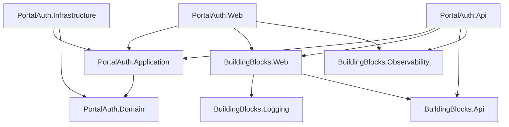

# Arquitetura

## Visao Geral

O PortalAuth nasce como uma plataforma corporativa .NET 8 para autenticacao, autorizacao e padronizacao tecnica de sistemas internos.

Nesta primeira entrega, a arquitetura implementa a fundacao minima:

- aplicacao MVC Razor;
- API REST;
- camadas `Application`, `Domain` e `Infrastructure`;
- Building Blocks reutilizaveis;
- health checks;
- correlation ID;
- logging de requisicoes;
- headers de seguranca;
- tratamento global de excecoes para API;
- response padrao para APIs.
- Controllers como entrada HTTP da API.
- MediatR para orquestrar requests entre API e Application.
- PostgreSQL como banco oficial.
- Tela de login MVC responsiva como primeira experiencia do PortalAuth Web.
- ASP.NET Core Identity persistido no PostgreSQL.
- Dashboard inicial protegido por autenticacao.
- Modulos administrativos para sistemas, permissoes, perfis e usuarios.
- Tela "Meus Sistemas" baseada nos sistemas liberados para os perfis do usuario.
- Auditoria de login, logout e alteracoes administrativas.
- Status operacional com health check real do PostgreSQL.

## Solucao

```text
Liotecnica.PortalAuth.slnx

/src
  /Liotecnica.PortalAuth.Web
  /Liotecnica.PortalAuth.Api
  /Liotecnica.PortalAuth.Application
  /Liotecnica.PortalAuth.Domain
  /Liotecnica.PortalAuth.Infrastructure
  /Liotecnica.BuildingBlocks.Web
  /Liotecnica.BuildingBlocks.Api
  /Liotecnica.BuildingBlocks.Logging
  /Liotecnica.BuildingBlocks.Security
  /Liotecnica.BuildingBlocks.Observability
/tests
  /Liotecnica.PortalAuth.UnitTests
```

## Dependencias Entre Camadas



## Padrao Obrigatorio Para APIs

Toda API deve seguir a separacao em camadas:

```text
Controller
  -> MediatR Request
  -> Handler
  -> Service
  -> Interface
  -> Model/DTO
  -> Domain/Infrastructure quando necessario
```

Estrutura recomendada:

```text
/Controllers
/Features
  /NomeDoModulo
    /Commands
    /Queries
/Models
/Services
/Interfaces
/Enums
```

Regras:

- Controller deve ser fino e nao conter regra de negocio.
- Controller deve delegar para MediatR.
- Handlers devem orquestrar o caso de uso.
- Services devem concentrar regra de aplicacao reutilizavel.
- Interfaces devem representar contratos entre camadas.
- Models/DTOs devem ser explicitos para entrada e saida.
- Enums devem ficar em pasta propria quando representarem conceitos compartilhados da Application.
- APIs devem retornar `ApiResponse<T>` para envelopes padronizados.
- Swagger deve estar acessivel em desenvolvimento e abrir automaticamente ao iniciar o perfil da API.

## Banco de Dados

Banco oficial: PostgreSQL.

Config atual:

- Provider EF Core: `Npgsql.EntityFrameworkCore.PostgreSQL`.
- DbContext: `PortalAuthDbContext`.
- Schema padrao: `portal_auth`.
- Connection string: `ConnectionStrings:PortalAuth`.
- Migrations no projeto `Liotecnica.PortalAuth.Infrastructure`.
- Tool local `dotnet-ef` versionada em `dotnet-tools.json`.
- Migration inicial `InitialPortalAuthSchema`.

Connection string local sem senha versionada:

```json
{
  "ConnectionStrings": {
    "PortalAuth": "Host=localhost;Port=5432;Database=liotecnica_portalauth;Username=postgres"
  }
}
```

Senhas e secrets devem ser configurados por User Secrets, variavel de ambiente ou cofre de segredos.

Entidade inicial persistida:

- `CorporateSystem`, mapeada para `portal_auth.corporate_systems`.
- `Permission`, mapeada para `portal_auth.permissions`.
- `RolePermission`, mapeada para `portal_auth.role_permissions`.
- `RoleSystemAccess`, mapeada para `portal_auth.role_system_access`.
- `AuditLog`, mapeada para `portal_auth.audit_logs`.
- `AppSetting`, mapeada para `portal_auth.app_settings`.

## Autenticacao

O PortalAuth Web usa ASP.NET Core Identity com:

- `ApplicationUser`;
- `IdentityRole<Guid>`;
- `PortalAuthDbContext`;
- cookie authentication;
- login em `/Account/Login`;
- dashboard protegido por `[Authorize]`.

Em desenvolvimento, o seed cria o usuario administrador inicial quando a aplicacao Web inicia e `Seed:AdminPassword` esta configurado em User Secrets.

## Administracao

As telas administrativas ficam protegidas por policies granulares de permissao.

Modulos atuais:

- Sistemas corporativos: CRUD de `CorporateSystem`.
- Permissoes: CRUD de permissoes granulares.
- Perfis: roles do Identity com vinculos em `role_permissions` e `role_system_access`.
- Usuarios: criacao, edicao de dados basicos, bloqueio e vinculo de perfis.
- Reset de senha administrativo com token do ASP.NET Core Identity.
- Exclusao logica de sistemas e permissoes.
- Bloqueio/reativacao de usuarios.
- Remocao protegida de perfis sem usuarios vinculados.

## Autorizacao Por Permissao

O Web usa policies dinamicas por codigo de permissao.

Componentes:

- `PermissionRequirement`;
- `PermissionAuthorizationHandler`;
- `PermissionPolicyProvider`;
- `PermissionCodes`.

Fluxo:

```text
Usuario autenticado
  -> AspNetUserRoles
  -> role_permissions
  -> permissions
  -> policy especifica
```

Controllers administrativos usam policies como:

- `Sistema.Visualizar`
- `Sistema.Criar`
- `Sistema.Editar`
- `Permissao.Gerenciar`
- `Perfil.Gerenciar`
- `Usuario.Gerenciar`
- `Auditoria.Visualizar`

Menus e botoes tambem usam `IAuthorizationService` para renderizacao condicional.

## Auditoria

Eventos relevantes sao registrados em `portal_auth.audit_logs`.

Eventos iniciais:

- login com sucesso;
- tentativa de login com falha;
- logout;
- criacao/edicao de sistemas;
- criacao/edicao de permissoes;
- criacao/edicao de perfis;
- criacao/edicao de usuarios;
- reset de senha administrativo;
- exclusao logica de sistemas e permissoes;
- bloqueio/reativacao de usuarios;
- remocao protegida de perfis;
- exportacao CSV da auditoria.

Cada registro armazena data/hora UTC, acao, entidade, identificador da entidade, usuario, IP, correlation ID e detalhes resumidos.

A tela `/Audit` e protegida pela permissao `Auditoria.Visualizar`.

A consulta de auditoria possui filtros por periodo, usuario, acao, entidade e busca textual em detalhes, correlation ID, IP e identificador da entidade. A paginacao e aplicada no servidor com limite de 10 a 100 registros por pagina.

A politica de retencao usa a configuracao `Audit.RetentionDays`, persistida em `portal_auth.app_settings`. A tela de auditoria permite atualizar a politica e executar limpeza manual de logs expirados.

A exportacao CSV reutiliza os filtros da consulta, limita o resultado a 10.000 registros e registra evento `AuditExported`.

## Meus Sistemas

O dashboard usa os perfis do usuario para carregar apenas os sistemas liberados.

Fluxo:

```text
Usuario autenticado
  -> AspNetUserRoles
  -> role_system_access
  -> corporate_systems ativos
  -> cards do dashboard
```

O botao "Acessar" aponta para a `BaseUrl` cadastrada em `CorporateSystem`.

## Building Blocks Implementados

### API

- `ApiResponse<T>`
- `ApiError`
- `ApiErrorDetail`
- `PagedResult<T>`

### Web

- `CorrelationIdMiddleware`
- `RequestLoggingMiddleware`
- `SecurityHeadersMiddleware`
- `ApiExceptionHandlingMiddleware`
- extensoes para registrar e aplicar os middlewares

### Logging

- `ICorrelationIdAccessor`
- `CorrelationIdAccessor`
- `CorrelationIdDefaults`

### Observability

- `AddLiotecnicaHealthChecks`
- `PostgreSqlHealthCheck`

Health checks:

- `self`: tags `live` e `ready`;
- `postgresql`: tags `ready` e `database`.

Endpoints:

- `/health/live`: valida apenas liveness;
- `/health/ready`: valida readiness, incluindo PostgreSQL.

## Endpoints Iniciais

API:

- `GET /api/v1/platform/status`
- `/swagger` em desenvolvimento
- `GET /health`
- `GET /health/live`
- `GET /health/ready`

Web:

- rota MVC padrao `{controller=Account}/{action=Login}/{id?}`
- `GET /Account/Login`
- `POST /Account/Login`
- `POST /Account/Logout`
- `GET /Dashboard/Index`
- `GET /Systems`
- `GET /Permissions`
- `GET /Roles`
- `GET /Users`
- `GET /Audit`
- `GET /Changelog`
- `GET /Status`
- `GET /health`
- `GET /health/live`
- `GET /health/ready`

## Proximas Decisoes

- Banco inicial para Identity.
- Estrategia de migrations.
- Modelo de permissoes.
- Forma de emissao e consumo de claims.
- Separacao entre PortalAuth Web e API no deploy.
